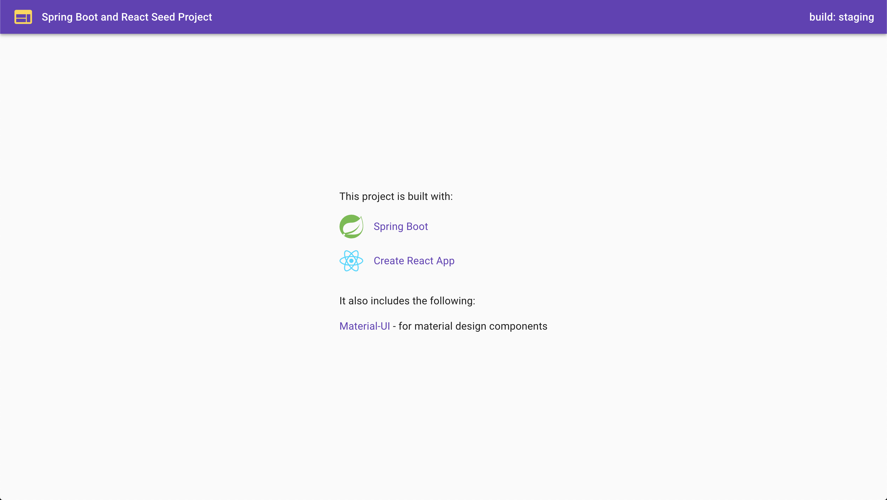

# Spring Boot and React

This is a seed project using Spring Boot for backend and React for frontend.

The frontend provides named build configurations for development, staging,
and production environments respectively:

- .env.dev
- .env.staging
- .env.prod

The project uses the following:

- Material-UI for material design components

## Preview

## Build

To build the project for staging, run `mvn clean install -Pnpm-build-staging`.

To build the project for production, run `mvn clean install -Pnpm-build`.

The build artifacts will be stored in the `target/` directory.

## Run

Run the following in the command prompt:

`java -jar target/springbootreact-0.0.1-SNAPSHOT.jar`

Navigate to http://localhost:8080/.